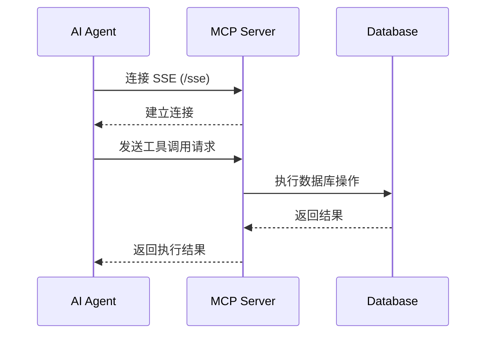

# DB MCP Server

<div align="center">


**一个基于 Spring Boot 和 Spring AI 的数据库 MCP (Model Context Protocol) 服务器**

[](https://spring.io/projects/spring-boot)
[](https://spring.io/projects/spring-ai)
[](https://www.oracle.com/java/)
[](LICENSE)


</div>

---

## 📖 项目简介

DB MCP Server 是一个强大的数据库连接和操作服务，通过 MCP (Model Context Protocol) 协议为 AI 应用提供数据库访问能力。项目采用响应式编程模型（WebFlux），支持多种主流数据库，为 AI Agent 提供安全、高效的数据库操作接口。

### ✨ 核心特性

- 🚀 **响应式架构** - 基于 Spring WebFlux 实现高性能异步通信
- 🔌 **多数据库支持** - 支持 MySQL、PostgreSQL、Oracle、SQL Server、KingBase
- 🛡️ **安全可靠** - 内置写操作预览和确认机制，防止误操作
- 📊 **元数据查询** - 支持查询表结构、索引、约束等数据库元信息
- 🔄 **事务支持** - 批量 SQL 执行支持事务，保证数据一致性
- 🎯 **MCP 协议** - 标准化的 AI 工具调用接口
- 📈 **监控就绪** - 集成 Spring Actuator，提供健康检查和监控端点

---


### 工作流程



### 核心组件

- **MCP Server** - 基于 Spring AI MCP Server WebFlux 实现
- **SSE 端点** - `/sse` 提供 Server-Sent Events 连接
- **消息端点** - `/mcp/messages` 处理 MCP 协议消息
- **工具提供者** - 通过 `@Tool` 注解自动注册数据库操作工具
- **连接池** - HikariCP 高性能数据库连接池

---

## 🚀 快速开始

### 环境要求

- Java 17 或更高版本
- Maven 3.6+
- 支持的数据库之一（MySQL、PostgreSQL、Oracle、SQL Server、KingBase）

### 安装步骤

1. **克隆项目**

```bash
git clone https://github.com/KISS-GG/DB_MCP_Server.git
cd DB_MCP_Server
```

2. **构建项目**

```bash
mvn clean package
```

3. **运行服务**

```bash
# 方式一：使用 Docker 运行
sh build.sh
docker-compose up -d

# 方式二：运行 JAR 包
java -jar target/db-mcp-server-0.0.1.jar
```

4. **验证服务**

访问健康检查端点：
```bash
curl http://localhost:8888/actuator/health
```

---


### MCP 客户端配置

在 Claude Desktop 或其他 MCP 客户端中配置：

```json
{
  "mcpServers": {
    "db-mcp-server": {
      "url": "http://localhost:8888/sse"
    }
  }
}
```


### 监控端点

Spring Actuator 提供以下监控端点：

- `http://localhost:8081/actuator/health` - 健康检查
- `http://localhost:8081/actuator/mappings` - 端点映射
- `http://localhost:8081/actuator/beans` - Bean 信息
- `http://localhost:8081/actuator/env` - 环境变量

---

## 📚 API 文档

### 可用工具列表

DB MCP Server 提供以下 6 个数据库操作工具：

#### 1. executeQuery - 执行查询 SQL

执行 SELECT 查询语句，返回查询结果。

**参数：**
- `dbType` (必填): 数据库类型 (mysql/postgresql/oracle/sqlserver/kingbase)
- `host` (必填): 数据库主机地址
- `port` (必填): 数据库端口
- `username` (必填): 用户名
- `password` (必填): 密码
- `database` (必填): 数据库名
- `sql` (必填): SQL 查询语句
- `params` (可选): SQL 参数列表
- `limit` (可选): 结果行数限制，默认 1000
- `timeout` (可选): 超时时间（秒），默认 30
- `useSsl` (可选): 是否使用 SSL

**示例：**
```json
{
  "dbType": "mysql",
  "host": "localhost",
  "port": 3306,
  "username": "root",
  "password": "password",
  "database": "test_db",
  "sql": "SELECT * FROM users WHERE age > ?",
  "params": [18],
  "limit": 100
}
```

#### 2. executeWrite - 执行写操作（预览模式）

执行 INSERT/UPDATE/DELETE 操作，返回预览信息和确认 ID。

**参数：**
- 基础连接参数（同 executeQuery）
- `sql` (必填): SQL 写操作语句
- `params` (可选): SQL 参数列表

**返回：**
- `confirmId`: 确认 ID，用于后续确认执行
- `preview`: 操作预览信息

**示例：**
```json
{
  "dbType": "mysql",
  "host": "localhost",
  "port": 3306,
  "username": "root",
  "password": "password",
  "database": "test_db",
  "sql": "UPDATE users SET status = ? WHERE id = ?",
  "params": ["active", 1]
}
```

#### 3. confirmWrite - 确认执行写操作

确认并执行之前预览的写操作。

**参数：**
- `confirmId` (必填): executeWrite 返回的确认 ID
- `timeout` (可选): 超时时间（秒），默认 30

**示例：**
```json
{
  "confirmId": "abc123-def456-ghi789"
}
```

#### 4. executeBatch - 批量执行 SQL

在同一事务中批量执行多条 SQL 语句，失败则全部回滚。

**参数：**
- 基础连接参数（同 executeQuery）
- `sqlList` (必填): SQL 语句列表
- `timeout` (可选): 超时时间（秒），默认 30

**示例：**
```json
{
  "dbType": "mysql",
  "host": "localhost",
  "port": 3306,
  "username": "root",
  "password": "password",
  "database": "test_db",
  "sqlList": [
    "INSERT INTO users (name, age) VALUES ('Alice', 25)",
    "INSERT INTO users (name, age) VALUES ('Bob', 30)",
    "UPDATE users SET status = 'active' WHERE age > 20"
  ]
}
```

#### 5. getMetadata - 查询数据库元数据

查询数据库表结构、索引、约束、注释等元信息。

**参数：**
- 基础连接参数（同 executeQuery）
- `tableName` (可选): 表名，不填则返回所有表名

**示例：**
```json
{
  "dbType": "mysql",
  "host": "localhost",
  "port": 3306,
  "username": "root",
  "password": "password",
  "database": "test_db",
  "tableName": "users"
}
```

**返回信息：**
- 表名和注释
- 列信息（名称、类型、长度、是否可空、默认值、注释）
- 主键信息
- 索引信息
- 外键约束

#### 6. executeDDL - 执行 DDL 语句

执行 CREATE/ALTER/DROP 等 DDL 语句（危险操作需确认）。

**参数：**
- 基础连接参数（同 executeQuery）
- `sql` (必填): DDL 语句
- `confirmed` (必填): 确认执行危险操作（DROP/TRUNCATE/ALTER 需设为 true）
- `timeout` (可选): 超时时间（秒），默认 30

**示例：**
```json
{
  "dbType": "mysql",
  "host": "localhost",
  "port": 3306,
  "username": "root",
  "password": "password",
  "database": "test_db",
  "sql": "CREATE TABLE test (id INT PRIMARY KEY, name VARCHAR(100))",
  "confirmed": false
}
```

⚠️ **安全提示：** 根据全局安全约束，禁止删除数据库的表和数据。执行 DROP/TRUNCATE/DELETE 等危险操作时需要特别谨慎。

---

## 💡 使用示例

### 示例 1：在 Claude Desktop 中查询数据


**用户提问：**
> "帮我查询 test_db 数据库中 users 表里年龄大于 25 岁的所有用户"

**AI 响应：**
AI 会自动调用 `executeQuery` 工具，执行查询并返回结果。

### 示例 2：安全的写操作流程


**步骤 1：预览写操作**
```
用户: "将 id 为 1 的用户状态更新为 active"
AI: 调用 executeWrite，返回预览信息和 confirmId
```


**步骤 2：确认执行**
```
用户: "确认执行"
AI: 调用 confirmWrite，使用 confirmId 执行操作
```

### 示例 3：查询表结构


**用户提问：**
> "查看 users 表的结构"

**AI 响应：**
AI 调用 `getMetadata` 工具，返回表的完整结构信息，包括列定义、主键、索引等。

### 示例 4：批量操作


**用户提问：**
> "批量插入 3 条用户记录"

**AI 响应：**
AI 调用 `executeBatch` 工具，在事务中执行多条 INSERT 语句。

---

## 🗄️ 支持的数据库

| 数据库 | 版本支持 | 驱动 | 默认端口 |
|--------|---------|------|---------|
| MySQL | 5.7+ | mysql-connector-j | 3306 |
| PostgreSQL | 10+ | postgresql | 5432 |
| Oracle | 11g+ | ojdbc11 | 1521 |
| SQL Server | 2012+ | mssql-jdbc | 1433 |
| KingBase | 8.6+ | kingbase8 | 54321 |

### 数据库连接示例

**MySQL:**
```json
{
  "dbType": "mysql",
  "host": "localhost",
  "port": 3306,
  "database": "mydb"
}
```

**PostgreSQL:**
```json
{
  "dbType": "postgresql",
  "host": "localhost",
  "port": 5432,
  "database": "mydb"
}
```

**Oracle:**
```json
{
  "dbType": "oracle",
  "host": "localhost",
  "port": 1521,
  "database": "ORCL"
}
```

---

## 🛠️ 技术栈

### 核心框架
- **Spring Boot 3.5.9** - 应用框架
- **Spring AI 1.1.2** - MCP Server 支持
- **Spring WebFlux** - 响应式 Web 框架

### 数据库相关
- **HikariCP** - 高性能连接池
- **JDBC Drivers** - 多数据库驱动支持

### 工具库
- **Hutool 5.8.41** - Java 工具类库
- **Lombok 1.18.42** - 简化 Java 代码

### 监控运维
- **Spring Boot Actuator** - 应用监控和管理

### 构建工具
- **Maven 3.6+** - 项目构建管理
- **Java 17** - 运行环境

---

## 📁 项目结构

```
db-mcp-server/
├── src/
│   ├── main/
│   │   ├── java/
│   │   │   └── top/zymnb/dbmcpserver/
│   │   │       ├── DbMcpServerApplication.java    # 应用入口
│   │   │       ├── config/
│   │   │       │   └── McpConfig.java             # MCP 配置
│   │   │       └── service/
│   │   │           └── McpService.java            # MCP 工具服务
│   │   └── resources/
│   │       └── application.yml                     # 应用配置
├── pom.xml                                         # Maven 配置
└── README.md                                       # 本文件
```

---

## ❓ 常见问题

### Q1: 如何配置 KingBase 数据库驱动？

KingBase 驱动需要手动安装到本地 Maven 仓库：

```bash
mvn install:install-file \
  -Dfile=kingbase8-8.6.0.jar \
  -DgroupId=cn.com.kingbase \
  -DartifactId=kingbase8 \
  -Dversion=8.6.0 \
  -Dpackaging=jar
```

### Q2: 连接数据库时出现超时怎么办？

检查以下几点：
1. 数据库服务是否正常运行
2. 网络连接是否畅通
3. 防火墙是否允许连接
4. 数据库用户权限是否正确
5. 可以增加 `timeout` 参数值


### Q3: 写操作的 confirmId 有效期是多久？

confirmId 默认有效期为 5 分钟，超时后需要重新执行 `executeWrite` 获取新的 confirmId。

### Q4: 支持连接池配置吗？

支持。可以通过环境变量或配置文件调整 HikariCP 连接池参数：

```yaml
spring:
  datasource:
    hikari:
      maximum-pool-size: 10
      minimum-idle: 5
      connection-timeout: 30000
```

### Q5: 如何处理大量数据查询？

1. 使用 `limit` 参数限制返回行数
2. 分页查询大数据集
3. 考虑使用索引优化查询性能
4. 对于超大结果集，建议导出到文件

---

## 🤝 贡献指南

我们欢迎所有形式的贡献！

### 如何贡献

1. **Fork 项目**
   - 点击右上角的 Fork 按钮

2. **创建特性分支**
   ```bash
   git checkout -b feature/your-feature-name
   ```

3. **提交更改**
   ```bash
   git commit -m "Add: 你的功能描述"
   ```

4. **推送到分支**
   ```bash
   git push origin feature/your-feature-name
   ```

5. **创建 Pull Request**
   - 在 GitHub 上创建 PR
   - 详细描述你的更改


### 代码规范

- 遵循 Java 编码规范
- 使用 Lombok 简化代码
- 添加必要的注释和文档
- 确保所有测试通过

---


## 📄 许可证

本项目采用 [MIT License](LICENSE) 开源协议。

```
MIT License

Copyright (c) 2026 DB MCP Server Contributors

Permission is hereby granted, free of charge, to any person obtaining a copy
of this software and associated documentation files (the "Software"), to deal
in the Software without restriction, including without limitation the rights
to use, copy, modify, merge, publish, distribute, sublicense, and/or sell
copies of the Software, and to permit persons to whom the Software is
furnished to do so, subject to the following conditions:

The above copyright notice and this permission notice shall be included in all
copies or substantial portions of the Software.

THE SOFTWARE IS PROVIDED "AS IS", WITHOUT WARRANTY OF ANY KIND, EXPRESS OR
IMPLIED, INCLUDING BUT NOT LIMITED TO THE WARRANTIES OF MERCHANTABILITY,
FITNESS FOR A PARTICULAR PURPOSE AND NONINFRINGEMENT. IN NO EVENT SHALL THE
AUTHORS OR COPYRIGHT HOLDERS BE LIABLE FOR ANY CLAIM, DAMAGES OR OTHER
LIABILITY, WHETHER IN AN ACTION OF CONTRACT, TORT OR OTHERWISE, ARISING FROM,
OUT OF OR IN CONNECTION WITH THE SOFTWARE OR THE USE OR OTHER DEALINGS IN THE
SOFTWARE.
```

---

## 🙏 致谢

感谢以下开源项目和技术：

- [Spring Boot](https://spring.io/projects/spring-boot) - 强大的 Java 应用框架
- [Spring AI](https://spring.io/projects/spring-ai) - AI 应用开发框架
- [MCP Protocol](https://modelcontextprotocol.io/) - 模型上下文协议
- [HikariCP](https://github.com/brettwooldridge/HikariCP) - 高性能连接池
- [Hutool](https://hutool.cn/) - Java 工具类库

特别感谢所有贡献者和使用者的支持！


## ⭐ Star History

如果这个项目对你有帮助，请给我们一个 Star！

[](https://www.star-history.com/#KISS-GG/DB_MCP_Server&type=date&legend=top-left)

---

<div align="center">

**[⬆ 回到顶部](#db-mcp-server)**

Made with ❤️ by KISS-GG

</div>
